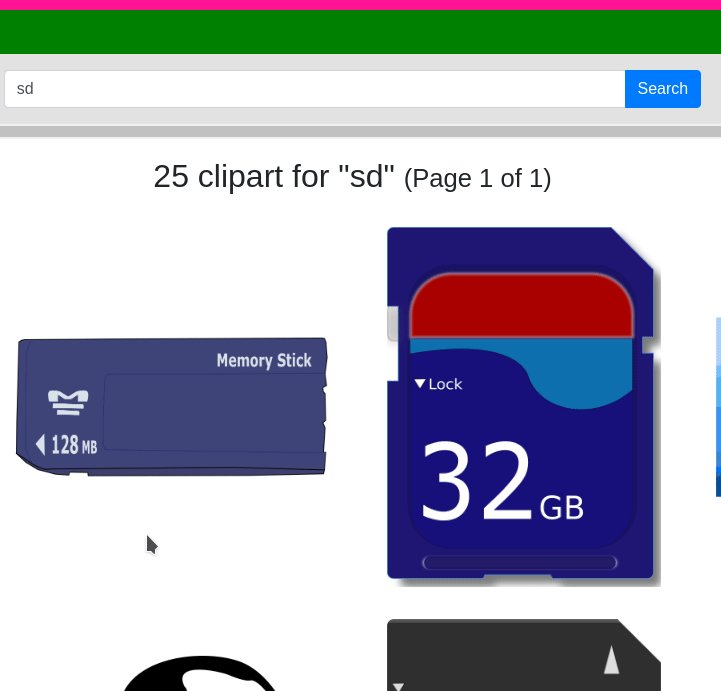

# OpenClipArt Chrome extension

This is a minimal working example of the Chrome extension for
downloading SVG images via context menu entry.

## How it works

Inspiration for this work was taken from Chrome extensions
[examples](https://developer.chrome.com/extensions/samples#search:contextmenus),
specifically one called __Download and Open Button__.

